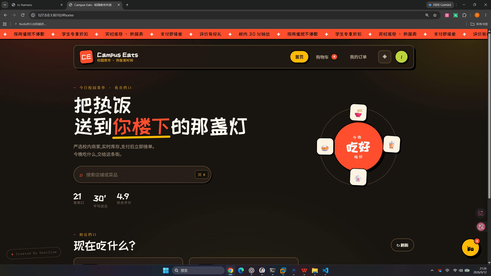

# cc-harness

一个本地 coding agent。默认打开基于 React/Vite 的 WebUI，但执行始终只有一套
Durable Runtime：任务、子任务、工具动作、审批和 checkpoint 写入本地事件存储。
浏览器关闭不会取消已提交的运行；重新打开同一个地址即可查看状态并继续。需要纯
终端时仍可显式使用 `--tui`，项目不依赖 Textual。

## 使用 cc-harness 生成的项目

下面是使用 cc-harness 驱动生成的 Campus Eats 校园外卖项目效果（示例项目不属于
本仓库，不会随本仓库提交）：

<p align="center">
  
</p>

## 安装与启动

要求 Python 3.11+，推荐使用 `uv`：

```powershell
uv tool install --editable .
cc-harness
```

也可以通过 npm 安装用户入口（当前 latest 为 `0.1.1`）：

```bash
npm install -g @liyanxiong278176/cc-harness@latest --registry https://registry.npmjs.org
cc-harness
```

npm 包只负责准备 Python 运行环境并转发参数，核心代码仍来自本项目；首次运行
会下载依赖，可能需要一些时间。当前 npm 包源码位于 [`npm/`](npm/)。

更新或卸载 npm 安装的入口：

```powershell
# 更新到最新版
npm install -g @liyanxiong278176/cc-harness@latest --registry https://registry.npmjs.org

# 检查已安装版本
npm list -g @liyanxiong278176/cc-harness --depth=0

# 卸载
npm uninstall -g @liyanxiong278176/cc-harness
```

如果曾经误装过旧的 `@lyx/cc-harness` 包，可单独卸载它：

```powershell
npm uninstall -g @lyx/cc-harness
```

开发时也可直接运行：

```powershell
python main.py
```

首次运行且没有模型配置时，会提示填写 OpenAI-compatible API Base URL、模型和
API key，并保存到 `~/.cc-harness/.env`。配置优先级为：进程环境变量 > 项目
`.env` > 用户 `~/.cc-harness/.env`。MCP 配置按用户级、项目级顺序合并，项目
同名配置覆盖用户配置。

### 沙箱服务自动启动

默认执行后端是 OpenSandbox。Durable supervisor 启动时会自动检查并启动（或复用）
`opensandbox-server`，确认 HTTP `/health` 和安全配置后才接受任务；首次执行命令时
才创建具体的沙箱容器。普通本地会话在检测到 SDK、Docker、server 不可用，或本机外部端点
缺少 attestation 时，会记录原因并自动切换到 `NativeExecutor`，因此仍可继续工作；切换会写入
`.cc-harness/logs/sandbox.jsonl` 和 activation manifest，界面/审计可以看到这是降级
执行。已发出的命令结果不确定时不会重放当前命令，只对后续命令使用本机执行。
安全策略、`hardened-safety`、Terminal-Bench/评测进程仍保持 fail-closed，不会绕过沙箱
伪造隔离成绩。代码工作区会以可写挂载提供给沙箱中的命令工具，以便创建和修改项目文件；
`.env`、`.ssh`、`.git/config` 等敏感路径会用空的只读遮罩覆盖，仍不会暴露给容器。
若要启用隔离执行，首次安装需要可用的 Docker 和沙箱依赖；没有这些依赖时普通本地
会话仍会按上面的审计降级路径工作：

```powershell
python -m pip install -e ".[sandbox]"
```

如需使用已经单独运行的服务，请在进程环境变量中设置
`CC_HARNESS_SANDBOX_SERVER_CONFIG_PATH`，或在项目 `policy.yaml` 的
`executor.sandbox.server_config_path` 中指定实际 TOML 路径，以便运行时校验 allowlist、
`dns+nft` 出站策略和 Docker 安全限制。明确使用宿主机执行时才传 `--host-execution`；
该模式不会启动 OpenSandbox。如需强制普通会话保持 fail-closed，可设置
`CC_HARNESS_SANDBOX_FALLBACK=hard`；显式设置 `CC_HARNESS_SANDBOX_FALLBACK=native`
可在没有 capability profile 的调用方中启用降级。

## 常用启动方式

```powershell
cc-harness                         # 启动本地 WebUI，打印并打开访问链接
cc-harness --no-open               # 启动 WebUI，但不自动打开浏览器
cc-harness --port 3080             # 默认端口被占用时自动顺延到下一个可用端口
cc-harness --tui default           # 使用兼容的终端控制面
cc-harness --runtime durable       # 显式选择唯一的 Durable Runtime（默认）
cc-harness --command supervisor    # 仅启动后台 Durable supervisor
cc-harness --tui default -c        # 在终端继续当前目录最近的会话
cc-harness --tui default -r        # 在终端选择当前目录的历史会话
cc-harness --tui default -r SESSION_ID # 在终端继续指定会话
cc-harness --cwd D:\work\project   # 指定工作目录
cc-harness --add-dir D:\shared     # 增加允许访问的目录，可重复
cc-harness -p "summarize this repo" # 非交互打印模式
```

管道输入会自动使用无 ANSI 的打印模式：

```powershell
"explain this error" | cc-harness
```

## WebUI 交互

- 启动后默认监听 `127.0.0.1:3080`；端口被占用时选择下一个空闲端口，并在终端打印
  实际链接。只有显式传入 `--host` 才会监听非回环地址，v1 不发放访问 token。
- 左侧会话按项目隔离，关闭浏览器只断开 SSE 连接，不会停止 Runtime；终端 `Ctrl+C`
  才会关闭 WebUI 并优雅停止活动运行。
- 必须先点击“选择项目文件夹”（无桌面环境可手动输入完整路径），未选择项目时输入
  框不可用。所选目录是该项目 Runtime 的工作根，跨项目不会共享会话或文件范围。
- 左下角“设置”填写 Base URL、模型名称和 API key；可先测试连接。API key 默认掩码，
  只有点击“显示”才在本地页面展示完整值，不会进入事件、日志或提示词。设置保存在
  `~/.cc-harness/webui.json`，新建 Runtime 时生效。
- 底部右侧圆环来自最近一次真实模型请求的输入 token 与模型窗口；没有遥测时显示 `—`，
  不推测百分比。点击圆环可查看对话、系统提示、工具、输出、摘要分类以及缓存读取、
  窗口来源（分类是 Runtime 的本地 tokenizer 明细，费用仍以 provider 返回为准）。
- 消息使用 Markdown 渲染，工具输出默认折叠；审批、停止、继续均调用现有 Durable
  Coordinator。系统提示词、隐藏规则、完整推理和工具参数不会发送到浏览器。
- 切换大历史会话时会显示“正在载入会话”并暂时禁用发送；右侧运行面板集中展示
  投影不一致、缺少完成证据、未知副作用、租约冲突和环境降级的脱敏诊断。短的纯对话
  由 Runtime 以已落盘的助手消息完成，编码任务仍必须通过工具/验证完成门。

前端源代码入口位于 [`web/src/main.tsx`](web/src/main.tsx)，cc-harness 适配层位于
[`web/src/cc/`](web/src/cc/)。页面依赖的 DeepSeek Harness 源码快照固定在
[`vendor/deepseek-ui/`](vendor/deepseek-ui/)，并记录官方 commit、许可证和第三方声明；
快照用于复用布局/交互语义，不会启动第二套 Runtime。开发时可运行 `npm install`、
`npm run dev`；发布构建可运行 `python scripts/build_webui.py`，它会把产物复制到
`cc_harness/web_assets/`，因此安装 Python wheel 后不需要 Node.js。
浏览器调用版本化的 `/api/web/v1` REST + replayable SSE 兼容层，旧 `/api`、TUI、
headless JSON 和 SDK 继续可用。启动链接和默认端口沿用
[DeepSeek Harness 的本地 WebUI 入口](https://github.com/deepseek-ai/deepseek-harness)
的使用习惯，但 cc-harness 保持自己的界面、品牌与 Runtime 协议。

本次对官方 DeepSeek Harness 的交互/视觉观察、模型环境变量映射、截图和
cc-harness 适配边界记录在 [`docs/deepseek-harness-ui-observations.md`](docs/deepseek-harness-ui-observations.md)。
审阅过的源码快照固定在仓库内 [`vendor/deepseek-ui/`](vendor/deepseek-ui/)，不会在构建时
联网拉取，也不会启动上游 Runtime。

## 当前评测结果访问路径

下面是本机已经完成的三套真实模型评测结果。命令行从仓库根目录
`D:\agent_learning\cc-harness` 执行；每个结果目录中的 `report.md` 是人工阅读版，
`summary.json` 是机器可读汇总，`state.json`、`progress.jsonl`、`raw/` 和
`integrity.json` 用于复核。`eval/result/` 已加入 `.gitignore`，因此这些大体积评测产物
只保存在本机，不会随代码提交。

| 评测套件 | 已完成结果目录（本机） | 直接查看 |
| --- | --- | --- |
| Terminal-Bench 2.1（89 个任务，5 trials/task） | `D:\agent_learning\cc-harness\eval\result\cc-only\terminal-bench-2.1\deepseek-v4-flash\full-new-260905220633\` | [`report.md`](eval/result/cc-only/terminal-bench-2.1/deepseek-v4-flash/full-new-260905220633/report.md) · [`summary.json`](eval/result/cc-only/terminal-bench-2.1/deepseek-v4-flash/full-new-260905220633/summary.json) |
| LoCoMo memory（1,986 QA） | `D:\agent_learning\cc-harness\eval\result\cc-only\locomo-memory\deepseek-v4-flash\full\` | [`report.md`](eval/result/cc-only/locomo-memory/deepseek-v4-flash/full/report.md) · [`summary.json`](eval/result/cc-only/locomo-memory/deepseek-v4-flash/full/summary.json) |
| AgentDojo v1.2.2 balanced（500 trials） | `D:\agent_learning\cc-harness\eval\result\cc-only\agentdojo-v1.2.2-balanced-500\deepseek-v4-flash\portfolio\` | [`report.md`](eval/result/cc-only/agentdojo-v1.2.2-balanced-500/deepseek-v4-flash/portfolio/report.md) · [`summary.json`](eval/result/cc-only/agentdojo-v1.2.2-balanced-500/deepseek-v4-flash/portfolio/summary.json) |

评测协议、数据版本、断点续跑规则和启动命令分别见
[`docs/eval/cc-only-benchmark-portfolio.md`](docs/eval/cc-only-benchmark-portfolio.md)。
如果结果目录已被移动，请以该目录下的 `manifest.json` 和 `integrity.json` 校验运行身份，
不要把其他 `check`、`archive` 或历史目录误当作正式成绩。

## TUI 兼容交互

- 启动页采用 Claude Code classic inline shell 的双栏结构，但使用 cc-harness 自有名称、版本、更新记录，以及从用户参考图提取的彩色遮脸月薪喵像素形象；窄于 80 列时自动改为上下布局。
- `Enter` 提交；`Alt+Enter`、`Ctrl+J` 或行尾 `\` 插入换行。超过 800 字符或 2 行的粘贴会折叠为可展开标记，不会自动提交。
- `Shift+Tab` 在 `default`、`auto-edit`、`bypass-prompts` 之间切换。
- `Ctrl+O` 查看完整对话与工具活动；`Ctrl+S` 暂存/恢复草稿；`Ctrl+L` 清屏重绘。
- `F2` 或 `/inspector` 打开 Run Inspector；左右键切换 Overview、Timeline、Token、Context、Files、Errors 标签。
- 全屏 TUI 默认保留终端原生鼠标拖拽选择/复制；若更需要鼠标滚轮滚动，可在
  `.cc-harness/settings.json` 的 `ui` 下设置 `"capture_mouse": true`，此时终端原生选择可能需要按住终端的修饰键。
- Inspector 只显示版本、摘要、token/cache 计数、digest、耗时和错误数量；永不显示有效提示词、规则正文、来源映射或可重建片段。
- `Alt+P` 选择模型；`Alt+T` 切换推理强度；`Alt+V` 从剪贴板附加图片。
- Durable TUI 中 `Ctrl+C` 终止当前 Run 及其子任务树：先停止新调度，再由
  worker 在安全边界收尾；无法确认的副作用保留为 `outcome_unknown`。检查点
  不会丢失，之后输入“继续”由主 Agent 读取状态后恢复；`Ctrl+D` 或 `/exit`
  只关闭控制界面，不会取消后台任务。
- 连按两次 `Esc` 会清空并暂存当前草稿；空输入时打开对话检查点恢复选择。
- 在输入框输入 `/` 会立即打开带说明的命令候选；继续输入可过滤，使用方向键和 `Enter` 选择。
- 命令候选使用中文解释；`/compact`、`/resume`、`/tools`、`/mcp` 等异步命令执行期间会在状态栏显示命令名和已用时间，完成后再提交结果。
- 输入 `@path` 可附加文本、目录索引或 PNG/JPEG/WebP/静态 GIF 图片。

光标和输入内容实际位于上下边框之间。无背景状态区域紧贴输入框下边框并每 0.5 秒动态刷新，不会固定到终端窗口底部。第一行按实际存在的数据依次显示模型、项目与 Git、会话名、会话时长和自定义短语；第二行显示真实上下文占用；第三行显示当前权限模式，并仅在 agent 服务可用时显示 agents 提示。可在用户级 `~/.cc-harness/settings.json` 或项目级 `.cc-harness/settings.json` 定制，项目配置覆盖用户配置：

```json
{
  "ui": {
    "custom_line": "🛩️  冲鸭",
    "show_project": true,
    "show_git": true,
    "show_duration": true,
    "show_session_name": true,
    "startup_blank_rows": 3
  }
}
```

可用 slash 命令只展示已经接通的能力：

```text
/help /init /release-notes /status /clear /resume /exit
/coding /plan /design /chat /mode
/model /effort /permissions /verbose
/context /compact /tools /mcp /usage /inspector
```

`/init` 在当前目录创建 `CC-HARNESS.md` 项目指令文件；`/release-notes` 显示内置版本记录。若文件已经存在，`/init` 不会覆盖。

### 工具能力包与费用

默认只把小型 core 工具包放入模型请求；Web、MCP 和领域工具必须显式启用，
以保持稳定的工具 schema 前缀并提高供应商 KV cache 命中率。配置同样遵循
进程环境变量 > 项目 `.env` > 用户 `~/.cc-harness/.env`：

```text
CC_HARNESS_TOOL_BUNDLES=core,web
```

费用只显示供应商 API 返回的直接 cost/currency 字段；供应商没有返回直接费用
时显示 `unavailable`，不会按 token 单价估算。`/usage` 与 Inspector 的 Token
页同时展示 API 输入、输出、缓存命中和直接费用状态。

## 会话与安全

每个启动目录拥有独立的 `.cc-harness/sessions.db`。可恢复记录包含经处理的完整
对话、工具调用和结果，但不保存模型的原始推理草稿。图片会复制到该会话的私有
附件目录，删除会话时一并删除。旧版 `logs/memory.db` 只读导入，不修改原库。

附件默认限于启动目录及 `--add-dir`。`.git`、`.venv`、`node_modules`、常见密钥
文件和不支持的二进制文件会被拒绝。`bypass-prompts` 仅跳过普通确认，不绕过
路径边界、sandbox、敏感信息与 hard-deny 规则。

WebUI 输入框左下角提供同样的三种权限策略：`请求批准`（默认，所有写入/外部动作在执行前暂停）、
`帮我批准`（自动放行工作区内的 Write/Edit，仅对命令、网络和外部副作用请求批准）、
`完全访问权限`（跳过普通审批）。选择会按当前项目保存，并在下一次新运行或当前运行结束后的继续操作中生效；
正在执行的 Run 不会被中途切换权限。三种模式都继续受路径边界、敏感凭据和安全 hard-deny 规则保护。

## 架构

```text
cc-harness / python main.py
  -> entrypoint.py
  -> WebUI (FastAPI + React/Vite, REST + replayable SSE)
  -> DurableRuntimeClient          # 唯一运行时：事件、审批、checkpoint、supervisor
  -> project-scoped Run Store      # 每个项目独立事件库与工作根

cc-harness --tui
  -> durable REPL                  # 兼容控制面，仍调用同一个 Runtime

旧 SessionRuntime/FullscreenTerminalApp 代码只用于历史数据迁移与测试兼容，
不再是可选择的运行时，也不会作为 Durable Run 的回退或子 agent 执行路径。
```

同一项目的并发由三层租约协调：`project_supervisor_lease` 只做 Supervisor
选主，`run_lease` 栅栏化单个 Worker，`run_resource_lease` 在工具动作边界按
文件、工作区或外部副作用做共享/独占冲突控制。因此同目录的独立会话可以
同时运行，重叠写入会等待而不会阻塞无关 Run。详细约定见
[`docs/runtime-leases.md`](docs/runtime-leases.md)。

中断、超时、工具幂等/对账、artifact 回收及 L3 优先记忆的边界行为见
[`docs/runtime-recovery-hardening.md`](docs/runtime-recovery-hardening.md)。

提示词采用版本化稳定前缀 + 动态运行时后缀；外部规则已经过审核、适配并固定在
本地 registry，生产运行时不会联网拉取提示词更新。TUI 的可观测信息只引用安全
元数据（版本、不可逆 digest、token/cache 计数、压缩统计和错误事实），不会泄露
生产提示词正文。

## 测试

```powershell
python -m pytest tests -q
python -m ruff check cc_harness tests
```

### 生产就绪检查

发布前可运行无模型的生产门禁；它会检查实际 Compose 配置、构建并启动镜像，
执行健康检查（以及可选迁移和冒烟命令），最后清理容器。没有健康 URL 或任一
必需步骤失败时，结果明确为未就绪，不会把单元测试结果冒充生产验证：

```powershell
python scripts/check_production_readiness.py --project-root . `
  --compose-file docker-compose.yml `
  --health-url http://127.0.0.1:8080/health `
  --migration-command docker compose run --rm app migrate `
  --smoke-command pytest tests/production -q

# 仅查看将执行的步骤（不会启动 Docker，也不会产生模型调用）
python scripts/check_production_readiness.py --dry-run --json
```

门禁输出 `ProductionReadinessReport`，包含每一步的退出码、耗时、脱敏日志和
失败原因，适合保存到发布证据中。

产品决策与边界见 [CONTEXT.md](CONTEXT.md)、[设计说明](docs/specs/2026-08-02-claude-code-classic-ui-parity-design.md)
和 [ADR](docs/adr/)。
