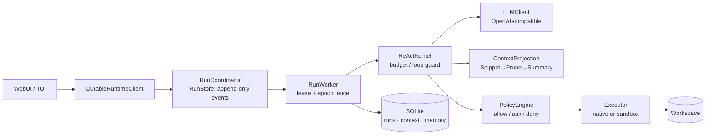

# cc-harness

本地运行的 coding agent：在选定项目目录里读写文件、执行命令、跑测试，并在浏览器 WebUI 里对话与审阅。
核心是一条 **Durable Runtime**（事件溯源 + 租约 + 可恢复执行），外围是上下文压缩、分层记忆、权限闸门与输出 DLP。

> 定位：单用户、本地、可审计的编程代理。**不是**多租户沙箱，也**不是**"无人值守跑任意外部代码"的运行时。

## 三个可复核的数字

| 评测 | 结果 | 口径 |
| --- | --- | --- |
| Terminal-Bench 2.1 | 89 任务 × 5 trials，**72/89 任务至少一次通过**（80.9%） | Harbor 本地执行，非官方 leaderboard 提交 |
| AgentDojo v1.2.2（500 trials） | 攻击成功 **0/306**；工具效用 74.8%（受攻击组）/ 87.1%（良性组） | 冻结子集，**带权限闸门**，不能与无审批榜单直接比较 |
| LoCoMo（1,986 QA） | 官方确定性 F1 **0.606**；分层记忆比完整历史注入省 **57.3%** 输入 token | 准确率 20/24 vs 24/24：省 token，但**没有**更准 |

机器汇总见 [`docs/eval-evidence/`](docs/eval-evidence/README.md)，口径与失败样例见
[评测方法](docs/eval-methodology.md)。所有结果均为单机、单模型（`deepseek-v4-flash`）可重复运行。

## 架构


```mermaid
flowchart LR
    UI[WebUI / TUI] --> C[DurableRuntimeClient]
    C --> S[RunCoordinator<br/>RunStore: append-only events]
    S --> W[RunWorker<br/>lease + epoch fence]
    W --> K[ReActKernel<br/>budget / loop guard]
    K --> LLM[LLMClient<br/>OpenAI-compatible]
    K --> CTX[ContextProjection<br/>Snippet→Prune→Summary]
    K --> P[PolicyEngine<br/>allow / ask / deny]
    P --> EX[Executor<br/>native or sandbox]
    EX --> WS[(Workspace)]
    W --> M[(SQLite<br/>runs · context · memory)]
```

一次任务的主链路：

1. `entrypoint` 解析参数 → `DurableRuntimeClient.submit()` 写入 `RunCreated/RunQueued`。
2. `LocalSupervisor` 选可运行的 run → `RunWorker.claim()` 拿 lease（带 epoch，过期提交会被拒）。
3. 每个 segment：重建投影 → 压缩上下文 → 调模型 → 工具动作经 `PolicyEngine` → 落事件。
4. 崩溃/中断后从事件日志恢复；工具结果不确定时记 `OUTCOME_UNKNOWN` 并要求显式对账，而不是盲目重放。
5. WebUI 只读事件流，不拥有第二套执行引擎。

更细的图与状态机见 [runtime 全景](docs/agent-runtime-full-flow.md)、[任务执行内核](docs/task-execution-kernel.md)、
[租约模型](docs/runtime-leases.md)。

## 快速开始

要求 Python 3.11+。

```powershell
python -m pip install -e .
cc-harness                     # 启动 WebUI（默认 http://127.0.0.1:3080/）
cc-harness --no-open --port 3080
```

首次运行需要 `.env`（`OPENAI_API_KEY` / `OPENAI_BASE_URL` / `OPENAI_MODEL`）。
模型与执行后端的选择写在 `policy.yaml`，默认执行后端是 OpenSandbox，Docker 不可用时按 profile 决定是否降级
（`standard` 降级到 host 并审计，`hardened` / `benchmark-one-shot` 直接失败）。
