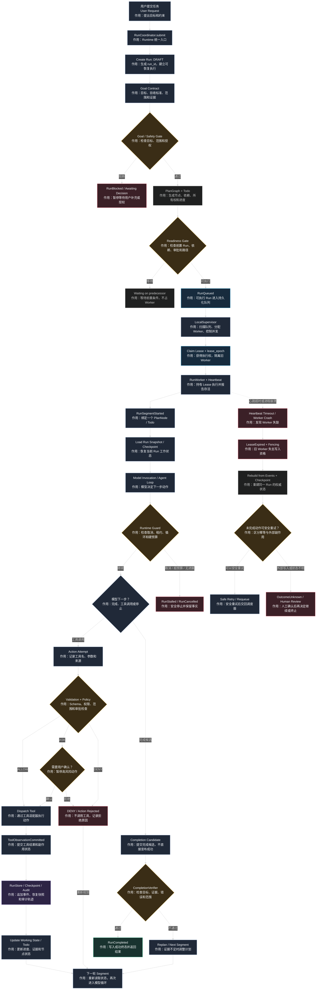

# Agent Runtime 流程图（Mermaid，单向清晰版）

```mermaid
%%{init: {"theme":"dark", "flowchart":{"curve":"linear","nodeSpacing":35,"rankSpacing":50}}}%%
flowchart TD

    U["用户提交任务<br/>User Request<br/>作用：提出目标和约束"]
    C["RunCoordinator.submit<br/>作用：Runtime 统一入口"]
    R["Create Run: DRAFT<br/>作用：生成 run_id，建立可恢复执行"]
    G["Goal Contract<br/>作用：目标、验收标准、范围和证据"]
    U --> C --> R --> G

    A{"Goal / Safety Gate<br/>作用：检查目标、范围和授权"}
    B["RunBlocked / Awaiting Decision<br/>作用：暂停等待用户补充或授权"]
    P["PlanGraph + Todo<br/>作用：生成节点、依赖、所有权和进度"]
    Q{"Readiness Gate<br/>作用：检查前置 Run、依赖、审批和路径"}
    W["Waiting on predecessor<br/>作用：等待前置条件，不占 Worker"]
    E["RunQueued<br/>作用：可执行 Run 进入持久化队列"]
    G --> A
    A -->|阻断| B
    A -->|通过| P --> Q
    Q -->|等待| W
    Q -->|可执行| E

    S["LocalSupervisor<br/>作用：扫描队列、分配 Worker、控制并发"]
    L["Claim Lease + lease_epoch<br/>作用：获得执行权，隔离旧 Worker"]
    K["RunWorker + Heartbeat<br/>作用：持有 Lease 执行并报告存活"]
    E --> S --> L --> K

    SEG["RunSegmentStarted<br/>作用：绑定一个 PlanNode / Todo"]
    SNAP["Load Run Snapshot / Checkpoint<br/>作用：恢复当前 Run 工作状态"]
    MODEL["Model Invocation / Agent Loop<br/>作用：模型决定下一步动作"]
    GUARD{"Runtime Guard<br/>作用：检查取消、租约、循环和硬预算"}
    NEXT{"模型下一步？<br/>作用：完成、工具调用或停止"}
    K --> SEG --> SNAP --> MODEL --> GUARD -->|继续| NEXT
    GUARD -->|取消 / 超预算 / 无进展| STOP["RunStalled / RunCancelled<br/>作用：安全停止并保留事实"]

    ACT["Action Attempt<br/>作用：记录工具名、参数和来源"]
    CHECK{"Validation + Policy<br/>作用：Schema、权限、范围和审批检查"}
    ASK{"需要用户确认？<br/>作用：暂停高风险动作"}
    TOOL["Dispatch Tool<br/>作用：通过工具适配器执行动作"]
    DENY["DENY / Action Rejected<br/>作用：不调用工具，记录拒绝原因"]
    OBS["ToolObservationCommitted<br/>作用：提交工具结果和副作用状态"]
    STORE["RunStore / Checkpoint / Audit<br/>作用：追加事件、恢复快照和审计轨迹"]
    UPDATE["Update Working State / Todo<br/>作用：更新进度、证据和节点状态"]
    NEXT -->|工具调用| ACT --> CHECK
    CHECK -->|ALLOW| TOOL
    CHECK -->|ASK| ASK
    ASK -->|确认| TOOL
    ASK -->|拒绝| DENY
    CHECK -->|DENY| DENY
    TOOL --> OBS --> STORE --> UPDATE
    DENY -->|重新规划| NEXT_SEG["下一轮 Segment<br/>作用：重新读取状态，再次进入模型循环"]
    UPDATE --> NEXT_SEG

    CAND["Completion Candidate<br/>作用：提交完成候选，不直接宣布成功"]
    VERIFY{"CompletionVerifier<br/>作用：检查目标、证据、错误和范围"}
    DONE["RunCompleted<br/>作用：写入成功终态并返回结果"]
    REPLAN["Replan / Next Segment<br/>作用：证据不足时调整计划"]
    NEXT -->|完成候选| CAND --> VERIFY
    VERIFY -->|通过| DONE
    VERIFY -->|不通过| REPLAN --> NEXT_SEG

    LOST["Heartbeat Timeout / Worker Crash<br/>作用：发现 Worker 失联"]
    EXP["LeaseExpired + Fencing<br/>作用：旧 Worker 失去写入资格"]
    REBUILD["Rebuild from Events + Checkpoint<br/>作用：重建同一 Run 的权威状态"]
    SAFE{"未完成动作可安全重试？<br/>作用：区分幂等与外部副作用"}
    RETRY["Safe Retry / Requeue<br/>作用：安全重试后交回调度器"]
    UNKNOWN["OutcomeUnknown / Human Review<br/>作用：人工确认后再决定继续或终止"]
    K -.->|心跳超时或进程崩溃| LOST --> EXP --> REBUILD --> SAFE
    SAFE -->|可以安全重试| RETRY
    SAFE -->|外部写入或状态不明| UNKNOWN

    classDef normal fill:#202938,stroke:#8aa4c8,color:#f8fafc;
    classDef state fill:#172b3d,stroke:#38bdf8,color:#f8fafc;
    classDef check fill:#3a2d16,stroke:#fbbf24,color:#f8fafc;
    classDef success fill:#19332f,stroke:#34d399,color:#f8fafc;
    classDef danger fill:#3b2027,stroke:#fb7185,color:#f8fafc;
    classDef store fill:#2d2445,stroke:#c4b5fd,color:#f8fafc;
    class U,C,R,G,S,K,SEG,SNAP,MODEL,NEXT,ACT,TOOL,OBS,UPDATE,NEXT_SEG,CAND,REPLAN,RETRY normal;
    class E,L state;
    class A,Q,GUARD,CHECK,ASK,VERIFY,SAFE check;
    class DONE success;
    class B,DENY,STOP,LOST,EXP,UNKNOWN danger;
    class STORE store;
```

说明：为保持线条清晰，`NEXT_SEG` 节点文字说明“再次进入模型循环”，不画跨越整张图的回路线。图中只展开 Agent Runtime，其他模块仅作为 Runtime 的接口依赖。
