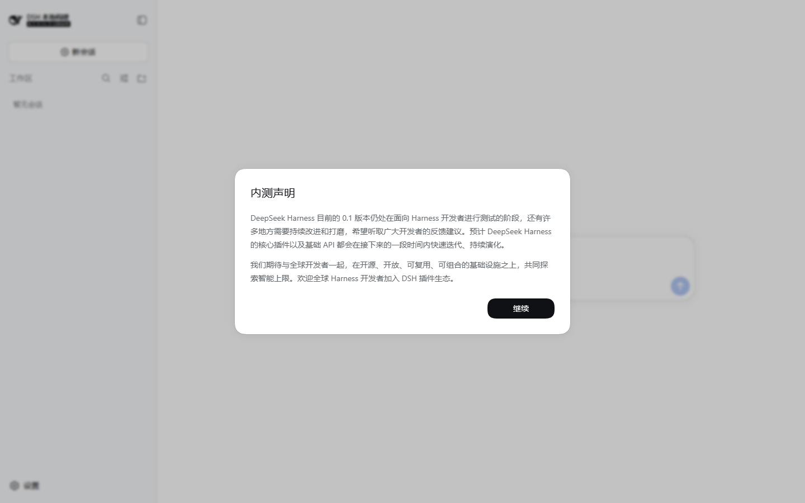
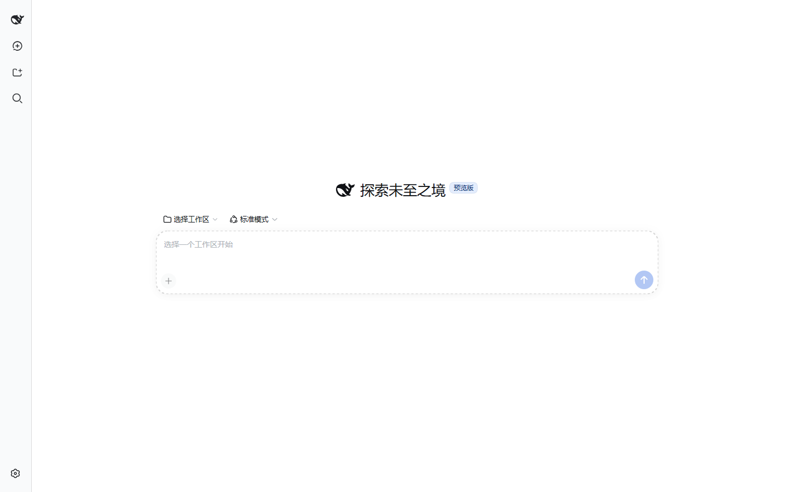
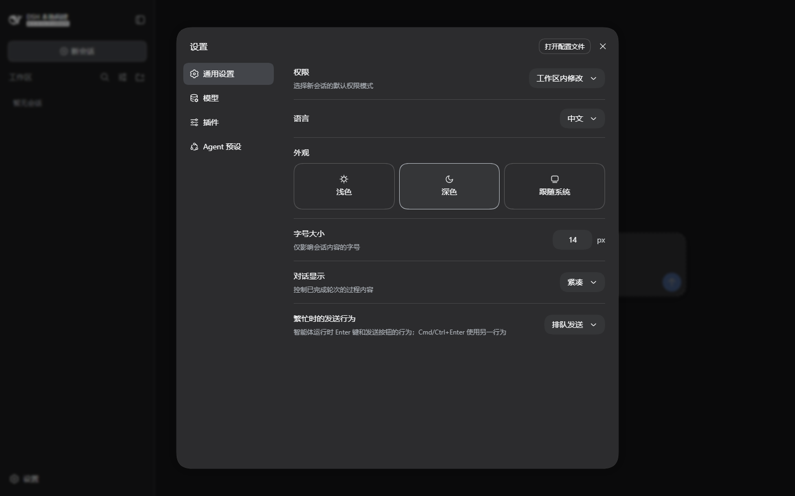
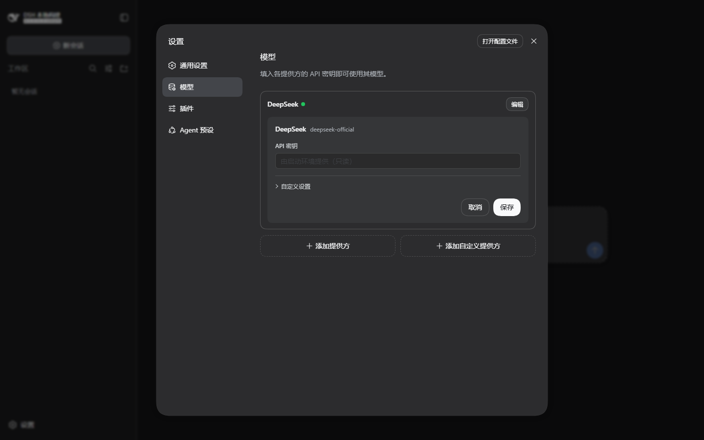
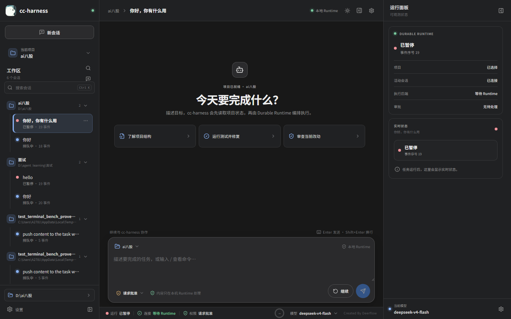
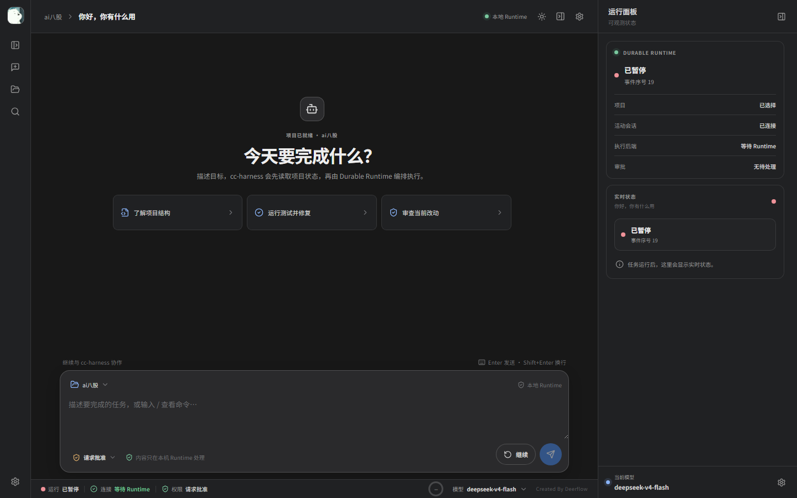

# DeepSeek Harness WebUI 观察与 cc-harness 适配记录

更新时间：2026-09-14  
参考源码：[`vendor/deepseek-ui/`](../vendor/deepseek-ui/)（原始 checkout 仅用于审阅）  
参考版本：`c291e7961a515f6d7af9304e7fd1d257929aef26`  
上游项目：[deepseek-ai/deepseek-harness](https://github.com/deepseek-ai/deepseek-harness)

## 观察环境与模型配置

我在独立目录拉取了官方仓库，没有把它的运行数据写入 cc-harness 的 Runtime 数据目录。执行了：

```text
pnpm install --frozen-lockfile
pnpm run build
pnpm dsh web --no-open --port 3090
```

官方 WebUI 在 `http://127.0.0.1:3090` 启动成功，使用独立的 `DSH_HOME`。为了验证模型连接方式，启动时将当前 cc-harness 的配置按名称映射到 DeepSeek Harness 的环境变量（不把值写入源码或文档）：

| cc-harness | DeepSeek Harness | 作用 |
|---|---|---|
| `OPENAI_API_KEY` | `DEEPSEEK_API_KEY` | DeepSeek 提供方凭据 |
| `OPENAI_BASE_URL` | `DEEPSEEK_BASE_URL` | Chat Completions 基址 |
| `OPENAI_MODEL` | `agent-default-model.model` 与 Web 会话模型选择 | 默认模型/会话模型（本次为 `deepseek-v4-flash`） |

本次隔离实例还写入了 `D:\agent_learning\deepseek-harness-reference\.dsh-home-observe\cordis.patch.yml`，
把 profile 默认路由固定为 `deepseek-official/deepseek-v4-flash`。该 patch 只包含提供方和模型
标识，不包含密钥；重新启动观察实例时，仍需在启动环境中执行同样的名称映射：

```powershell
$env:DSH_HOME = 'D:\agent_learning\deepseek-harness-reference\.dsh-home-observe'
$env:DEEPSEEK_API_KEY = $env:OPENAI_API_KEY
$env:DEEPSEEK_BASE_URL = $env:OPENAI_BASE_URL
pnpm dsh web --no-open --port 3090
```

上面的命令假定当前 PowerShell 已加载 cc-harness 的 `OPENAI_*` 环境变量；不会把凭据写入
参考 checkout 或本仓库。

官方适配器的模型路由是 `deepseek-official`，模型 ID 原样传递；它还支持在 Web 的 Models 设置中编辑提供方、API 地址和模型列表。密钥保持在启动环境中时，官方页面会显示“由启动环境提供（只读）”，不会把密钥回显到浏览器。

本次观察只验证了启动、配置展示和页面交互，没有提交真实模型请求，避免在观察阶段产生额外调用费用或写入测试会话；实际模型请求仍由用户在选择工作区后发起。

## 实际页面交互记录

### 首次启动与空工作区

首次打开会显示一次“内测声明”对话框，点击“继续”后进入空工作区。主区域显示品牌/预览版标题、`选择工作区`、Agent 预设选择和空 composer；没有工作区时 composer 仍挂载，但发送动作不可用。



本轮还在独立的官方实例（`127.0.0.1:3090`，独立 `DSH_HOME`）中关闭首次配置弹窗，重新抓取了
2048×1080 的真实空白会话截图：[官方现场截图](reference-observation/deepseek-harness-live-main-recheck-20260914.png)。
截图中可以确认：品牌与“新会话”固定在 280px 侧栏，主区域没有多余顶部导航，Hero 标题和预览徽标居中，
工作区/模式入口位于输入卡上方，输入卡使用无边框 22px 圆角和圆形发送按钮。

### 三栏布局与侧栏轨道

- 默认是三列 AppFrame：左侧约 280px，中间会话区，右侧为 edge-anchored 面板。
- 左侧包含品牌行、整行“新会话”、工作区/会话浏览区、搜索入口，设置固定在底部。
- 收起侧栏后保留 56px rail，而不是把导航列移除；rail 中保留品牌标记、新会话、选择工作区、搜索和设置等快捷入口。
- 侧栏滚动条只在需要时出现，并通过稳定 gutter 避免列表跳动。



### 工作区与会话浏览

工作区是会话的第一层分组；同一路径下的会话显示在自己的树节点中。工作区支持展开/折叠、路径悬停卡片、排序/视图选项；会话支持搜索、重命名、归档、分叉等动作。搜索激活后扩展为 header 内的输入框，结果变成扁平列表，选择结果后回到原分组并定位会话。

### 会话内容与长对话

- 中间区域只有一个滚动容器，composer 固定在底部，不会随着消息把发送区挤出视口。
- 已完成轮次默认将 reasoning、工具调用和重试过程折叠，只保留用户请求和最终回答；过程控制可以手动展开。
- 正在运行的过程保持展开并显示活动状态；最终回答不会被过程折叠隐藏。
- 新消息到达时，如果阅读者已经离开底部，显示“跳到最新”入口；阅读位置不会被强行抢走。
- 输入提交先显示本地回显，权威 Session 记录到达后一次性替换；排队中的消息放在 Chat 之外的队列区域。

### 输入与快捷交互

- `Enter` 发送，`Shift+Enter` 换行；忙碌时发送策略由设置控制（排队/转向）。
- 输入 `/` 或 `@` 时打开分组候选菜单；菜单使用 mousedown 选择，composer 保持焦点，`Tab`/`Enter` 可键盘选择，`Escape` 关闭。
- “添加文件或调用指令”从 composer 左下角进入；引用文件/会话以可编辑 token 保留在原输入位置。

### 设置、权限和右侧面板

官方设置是一个大尺寸 modal，左侧分为“通用设置、模型、插件、Agent 预设”，右侧编辑对应内容；通用设置提供权限默认值、语言、浅色/深色/跟随系统、字号、对话显示密度和忙碌发送行为。



模型页按提供方分组，提供方卡片支持“编辑”和“添加自定义提供方”；编辑卡片包含 API 密钥（启动环境密钥只读）、API 地址和模型列表。



官方右侧 Sidebar 在正常模式占据右侧轨道，窄屏自动切换 fullscreen；关闭后通过会话 header 的角落按钮重新打开，而不是覆盖中间会话。cc-harness 继续在这个位置展示 Runtime 状态、事件序号、审批和执行后端，这是产品差异而不是布局冲突。

## 已适配到 cc-harness 的内容

本次改动保留 cc-harness 的 REST/SSE、Durable Runtime、审批、上下文遥测和事件审计，只调整 WebUI 视图层：

| 参考体验 | cc-harness 状态 | 适配说明 |
|---|---|---|
| 280px 三栏 AppFrame | 已适配 | 默认 `280px / minmax(0, 1fr) / 360px`，窄屏逐级收缩 |
| 56px 收起 rail | 已适配 | rail 保留品牌、新会话、工作区、搜索、设置；不再把左栏压成 0px |
| 整行新会话按钮 | 已适配 | 品牌行下增加“新会话”按钮，旧图标入口仍可用 |
| 工作区分组会话 | 已有并强化 | 侧栏标题改为“工作区”，路径下显示会话及状态/事件序号 |
| rail 搜索 | 已适配 | 点击 rail 搜索会恢复侧栏并把焦点放入搜索框 |
| 固定 composer 与滚动 | 已适配 | conversation 单独滚动，composer/footer 固定在主面板底部 |
| 紧凑过程折叠 | 已有并强化 | 不展示完成协议 JSON，过程和工具卡使用低干扰折叠样式 |
| 权限入口 | 已有并强化 | composer 左下保留三种权限策略和当前生效提示 |
| 右侧 edge 状态面板 | 已适配 | 采用官方中性卡片和可收起几何，保留 Runtime 专属状态内容 |
| 模型设置 | 已有并强化 | 保留 cc-harness 的 `base_url`、API Key、模型字段；使用官方相同的 modal/表单视觉 |
| 上下文圆环 | 有意保留 | cc-harness 的真实上下文/压缩遥测是核心能力，放在底部模型状态旁，不复制官方不存在的伪数据 |

适配后的 cc-harness 页面（同一套三栏与 rail 规则）：



本轮按上述现场截图调整了新会话的居中舞台，并用同样的 2048×1080 视口复核：
[cc-harness 项目空会话](reference-observation/cc-harness-live-project-empty-2048x1080-after-20260914.png)
和[cc-harness 未选择项目](reference-observation/cc-harness-live-empty-2048x1080-after-20260914.png)。
空白态隐藏重复的顶部会话导航，Hero 与输入卡按官方比例居中；项目未选择时保留文件夹操作并把输入卡下移，
避免遮挡按钮。已有会话不进入该模式，仍保留对话滚动、固定 composer、底部模型/上下文和右侧 Runtime 面板。



## 验证证据

当前 cc-harness WebUI（`http://127.0.0.1:3080`）使用 Playwright 做了无模型调用的交互检查：

```text
收起侧栏后：grid-template-columns = 56px 1024px 360px
rail 快捷入口：展开侧栏、新建会话、选择工作区、搜索会话
点击 rail 搜索：search focused = true；布局恢复为 280px 800px 360px
输入查询：搜索框保留焦点并接受文本
conversation：clientHeight = 580，scrollHeight = 2100，overflow = auto
composer：top = 640，bottom = 866，viewport = 900（底部未被消息挤出）
scrollbar-gutter：session-list = stable
完成协议 JSON：用户可见匹配数 = 0
```

构建验证：

```text
web: npm run build                 PASS
```

## 与官方实现保持边界

官方 Harness 是完整的插件化客户端，拥有更丰富的 Session Controller、队列、文件预览、拖拽排序、目录 picker 和右侧资源 tab。cc-harness 当前是一个薄 WebUI 控制面，后端事件源和 Durable Runtime 不应被替换成官方客户端的第二套状态机。因此本次采用“同一交互契约 + 同一视觉语言 + cc-harness 事件/Runtime 数据源”的适配，而不是引入第二套 Agent Runtime。
