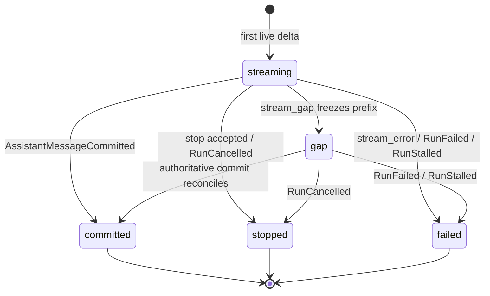

# WebUI 易失流与 Durable 对账

日期：2026-09-30

本文件记录当前实现。运行状态、检查点、审批、工具结果和完整 assistant 回复仍由 Durable Runtime 持有；浏览器中的逐块文本只是即时展示状态。`AssistantMessageCommitted` 是完整正文的权威来源。

## 数据路径与边界

```text
LLMClient StreamEvent
        |
        v
DurableModelAdapter.complete(stream_callback=...)
        |
        v
RunWorker（run_id / segment / monotonic chunk）
        |
        v
WebRuntimeManager._emit_live_stream
        |
        v
LiveStreamHub（进程内、有界队列） ---> SSE event: stream
                                      |
                                      +--> 浏览器内存 reducer

RunWorker -------------------------> Durable run_events / artifacts
                                      |
                                      +--> SSE event: runtime / timeline
                                           authoritative reconciliation
```

`LiveStreamHub` 是尽力而为的进程内扇出。它不写 SQLite，也不是 Run 的恢复依据。worker 的流回调异常不会改变模型段结果。Durable 事件树会继续低频对账，因此 SSE 同时承载即时 `stream` 和已提交 `runtime` 记录。

临时 delta 包络示例：

```json
{
  "type": "stream_delta",
  "run_id": "run-id",
  "segment": 0,
  "chunk": 12,
  "kind": "content",
  "text": "partial text"
}
```

当前 live `kind` 为 `content`、`reasoning`、`tool_call_delta` 和 `done`。SSE 还可发 `stream_gap`，提示有界队列丢弃了临时片段；错误由 `stream_error` 表达。worker 约每 40ms 或达到 4096 字符时合并正文块；边界、reasoning 和工具增量保持顺序。

`reasoning` 是独立的内存态。前端按 `run_id/segment/chunk` 去重，写入 reasoning 字段，不拼入正文。收到正文时折叠 thinking 区块，并显示本回合已观察到的思考秒数。仅刷新后，live reasoning 不会重放。

### reasoning 持久化边界

新写入的 assistant-message artifact 和旧 agent 会话消息不包含 raw `reasoning_content`。`assistant_message` 构造器不接受该字段，worker 只提交模型可见正文、工具调用和现有 provider metadata。原始 reasoning 只在 provider 流与浏览器内存 reducer 中暂存，不进入 Durable 事件、artifact 或会话检查点。

对于只返回 reasoning、没有可见正文或工具调用的响应，LLM client 不再把 reasoning 充当答案；它会暂缓第一次 `done`，并以 thinking-disabled 模式重试一次。旧 provider 也可能因旧 artifact 的 reasoning 回放字段缺失而报协议错误；现有一次性降级会移除该字段后再请求。

在 ADR-0089 决策期间写入的历史 assistant artifact 可能仍含 raw reasoning。它们保持不可变并可被旧会话读取，没有做未经请求的数据改写。新持久化路径及回放行为见 [ADR-0090](../adr/0090-keep-raw-model-reasoning-transient.md)。

## SSE 与重连

1. 新 SSE 订阅先登记到 `LiveStreamHub`，再读取 Durable 事件树，缩小浏览器加载与订阅之间的竞态窗口。
2. `event: stream` 发送临时 `stream_delta`/`stream_gap`；`event: runtime` 发送 Durable 投影和游标。Durable event id 使用根 run 的序号形式，服务端也接受 `run_id:sequence`。
3. 服务端读取 `Last-Event-ID`，用 Durable 序号继续扫描事件树。临时 live id 不是 Durable cursor，LiveStreamHub 的历史缓存不参与断线恢复。
4. 前端以 run/segment/chunk 去重临时片段；收到 `AssistantMessageCommitted` 时丢弃该回合的临时 assistant 节点并展示已提交正文。
5. SSE 错误或 gap 时前端冻结当前临时前缀、显示对账提示并刷新 Durable timeline。reconnect 后正文由持久投影校准；未提交 reasoning 可能丢失，不能自动重发模型请求。

因此 `Last-Event-ID` 保证的是 Durable 事件游标继续推进，不保证临时 token 被补发。用户刷新/重连后不会把临时文本当成事实；live history ring 当前没有被接入 SSE 回放端点。

## 长历史与工具结果边界

- 浏览器最多请求 10,000 个已投影 timeline event，再以 conversation turn 为单位用 TanStack Virtual 测量并挂载视口附近的行。顶部阅读时，新事件只显示“跳到最新消息”，不改变当前 scrollTop；大跨度跳转立即落到底部，近距离移动保留平滑过渡。
- 工具卡片只读取后端安全投影的预览、数量、`observation_id` 和 `next_cursor`。`ContinueToolResult` 从当前 Run 的持久观察记录中解析来源；它不会跨 Run 查找旧 observation。
- 因此只在源 observation 属于当前可恢复 Run 且没有更后的 `FollowUpQueued` 时显示续读按钮。Run 已完成、或消息已排进新 child Run 后，卡片说明该 Runtime 不支持跨 Run 续读，不触发一个必然失败的子 Run。
- stop 保留临时正文。只有最后用户消息之后没有 `ActionStarted`、`ActionSucceeded`、`ActionFailed`、`ToolObservationCommitted` 或 `ApprovalDecided` 时，前端才提供同文本安全重试；检查点恢复仍走 Runtime 现有 resume API。

## 状态机



`stream_gap` 本身不等于 Run 失败：`gap` 是已冻结临时前缀、等待权威对账的 UI 状态。Run 是否继续运行以 Durable 状态为准。停止操作使用既有 stop API，并保留已显示前缀；没有工具副作用的停止回合允许安全重试，有副作用或需要检查点继续时走既有 resume API。

## 前端 reducer 约束

- reasoning/content 独立累加；assistant commit 清除临时输出。
- `segment` 改变时不把上一轮工具调用前后的文本拼成一个正文。
- 重复 chunk 丢弃；有缺口时冻结当前前缀，不猜补字符。
- 触发 gap/连接错误不会取消后台 Run，也不会改变恢复、审批或持久化状态机。
- markdown 渲染沿用现有 `marked` + DOMPurify 路径。
